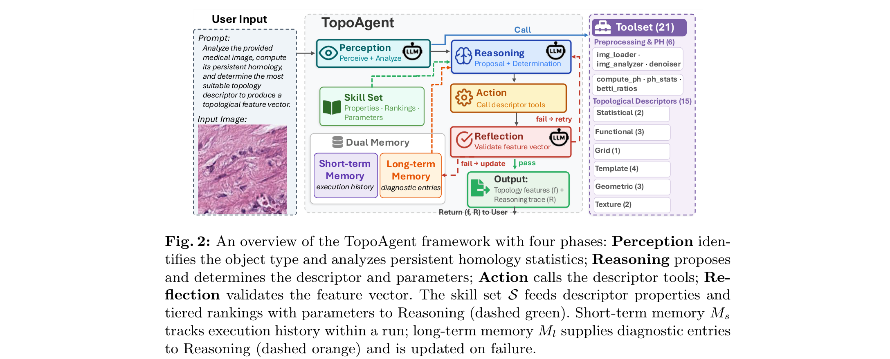
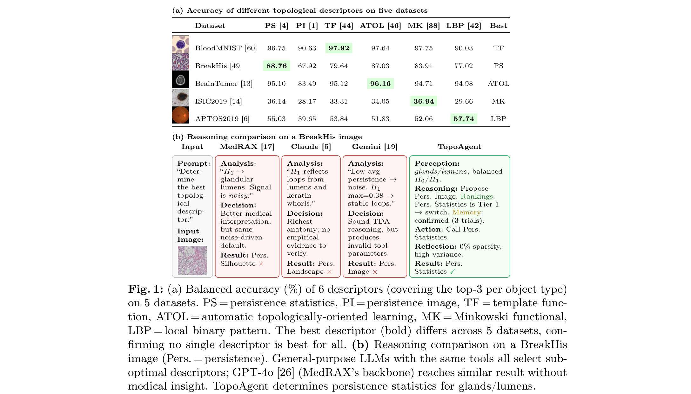
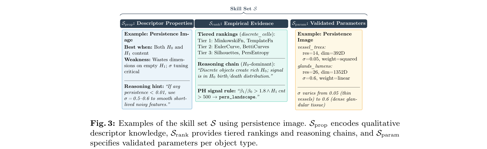
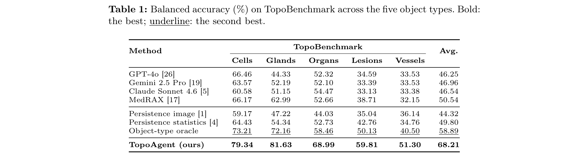
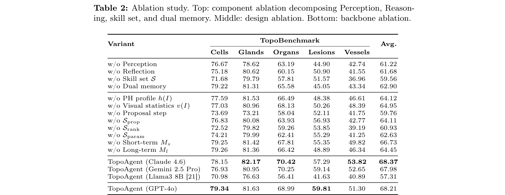
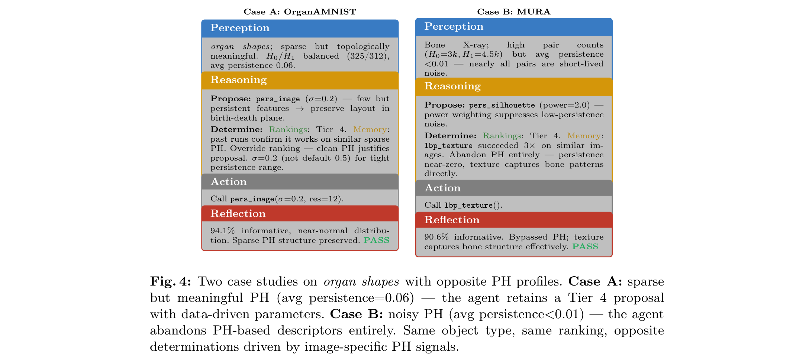
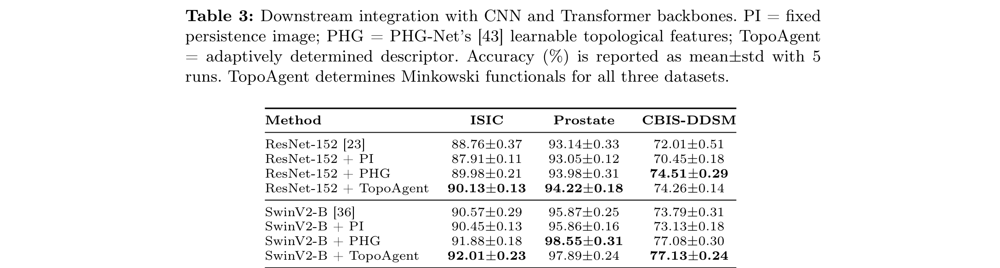

# TopoAgent

**An Agentic Framework for Automated Topology Learning in Medical Imaging** — ECCV 2026

TopoAgent is a LangGraph-based LLM agent that, given a raw medical image and a task prompt, automatically determines the most suitable **topological descriptor** (and its parameters) and produces a topological feature vector for downstream classification — all without task-specific training. It operates through a **Perception–Reasoning–Action–Reflection (PRAR)** loop backed by 21 domain-specific tools, dual memory, and a benchmark-distilled skill set.



> **Perception** identifies the object type and analyzes persistent-homology statistics; **Reasoning** proposes and determines the descriptor and parameters; **Action** calls the descriptor tools; **Reflection** validates the feature vector and retries on failure.

---

## Table of Contents

- [Why TopoAgent](#why-topoagent)
- [How It Works — the PRAR Loop](#how-it-works--the-prar-loop)
- [Results](#results)
- [Installation](#installation)
- [Running TopoAgent](#running-topoagent)
- [Code Structure](#code-structure)
- [Datasets](#datasets)
- [Citation](#citation)

---

## Why TopoAgent

Persistent homology (PH) captures structural properties — connected components, loops, and shape — that pixel-level deep learning often neglects. Many *topological descriptors* convert persistence diagrams into fixed-length feature vectors, but **no single descriptor is best across datasets**: the best choice depends on the interaction between a dataset's morphology and each descriptor's mathematical properties, so it normally demands TDA expertise and trial-and-error.

As the figure below shows, the best descriptor changes from dataset to dataset (left), and general-purpose LLMs given the same tools still pick sub-optimal descriptors because they lack empirical grounding (right). TopoAgent automates this per-image determination and produces a full reasoning trace.



---

## How It Works — the PRAR Loop

TopoAgent runs a four-phase loop (implemented as a LangGraph state machine in [`topoagent/workflow.py`](topoagent/workflow.py)):

| Phase | What it does |
|-------|--------------|
| **Perception** | Six perception tools compute a **PH profile** `h(I)` (birth–death counts per homology dimension, average persistence, Betti ratio `β1/β0`) and **visual statistics** `v(I)` (SNR, contrast, edge density). The LLM then jointly reasons over the raw image and its PH to identify the **object type** `o ∈ {cells, glands/lumens, organ shapes, vessel trees, surface lesions}`, which indexes the skill set. |
| **Reasoning** | Two steps with *asymmetric information access*. A **proposal** step sees descriptor properties `Sprop` and only *stripped* reasoning patterns (no rankings) to avoid anchoring bias; a **determination** step then integrates the full rankings `Srank` and long-term memory `Ml` to finalize the descriptor `d*` and parameters `θ*`. |
| **Action** | Runs the determined descriptor tool to produce a feature vector `f ∈ R^{n_d}`, using parameters validated during skill-set construction (reproducible, not LLM-generated). |
| **Reflection** | The LLM validates `f` against quality criteria (sparsity, variance, kurtosis, skewness, dynamic range, informative-feature ratio). On failure it records a diagnosis in `Ml` and retries (≤ 2 retries within a time budget); otherwise it falls back to the top-ranked descriptor for `o`. |

### Tools (21)

**6 perception tools:** `image_loader`, `image_analyzer`, `noise_filter`, `compute_ph` (GUDHI cubical-complex filtration), `topological_features` (PH profile), `betti_ratios`.

**15 descriptor tools** — 10 PH-derived: `persistence_image`, `persistence_landscapes`, `persistence_silhouette`, `persistence_entropy`, `persistence_statistics`, `betti_curves`, `template_functions`, `atol`, `persistence_codebook`, `tropical_coordinates`; and 5 image-based: `minkowski_functionals`, `euler_characteristic_curve`, `euler_characteristic_transform`, `lbp_texture`, `edge_histogram`.

> Note: `topoagent/tools/__init__.py` registers a larger superset of tools (including legacy classifiers and filtration variants from earlier versions); the PRAR pipeline uses the 21-tool subset above. The current paper pipeline is **v9** (`agentic_v9=True`); v2–v8 remain in the code for reference.

### Skill set S

The skill set encodes the domain expertise the LLM lacks. It is distilled **offline** from [`RuleBenchmark/`](RuleBenchmark/) (15 descriptors × 26 datasets × 6 classifiers) and organized at the object-type level to prevent dataset leakage. It lives in [`topoagent/skills/`](topoagent/skills/):

- **`Sprop`** — descriptor mathematical properties, strengths/weaknesses, and parameter heuristics (used in the *proposal* step).
- **`Srank`** — per-object-type tiered rankings, reasoning chains, and threshold-based PH signal rules (used in the *determination* step).
- **`Sparam`** — validated parameters for all descriptor × object-type combinations (used in *Action* and as a deterministic fallback).



### Dual memory

- **Short-term `Ms`** — tool invocations within a single run (the LLM's context window).
- **Long-term `Ml`** — diagnostic entries across runs *within a dataset* (failed descriptor, diagnosed cause, successful correction); reset between datasets to prevent cross-dataset leakage. Seeds live in `topoagent/memory/*.json` (empty by default).

---

## Results

Evaluated on **TopoBenchmark** — a frozen benchmark of **113,182 samples** from **26** public 2D medical datasets across five object types, with convergence-based per-dataset sizing, precomputed PH caches, and fixed fold indices (harness in [`TopoBenchmark/`](TopoBenchmark/)).

### Main results

TopoAgent obtains **68.21%** average balanced accuracy, outperforming the strongest baseline (object-type oracle) by **9.32%** and general-purpose LLMs equipped with the same tools by **over 21%**.



### Ablation

Every PRAR component contributes; the skill set `S` is the most impactful, and dual memory matters most for lesions and vessels (whose PH profiles deviate most from general rankings).



### Case studies

Two organ-shape images with the *same* object type and *same* ranking recommendation receive *opposite* determinations, driven by image-specific PH signals — showing the value of per-image reasoning over a fixed rule.



### Downstream integration

TopoAgent's determined descriptors plug into CNN/Transformer backbones (ResNet-152, SwinV2-B) following the PHG-Net fusion protocol, matching or exceeding learnable topological features without a differentiable PH layer.



---

## Installation

```bash
git clone https://github.com/gm3g11/TopoAgent.git
cd TopoAgent
pip install -r requirements.txt
```

Key dependencies: `langgraph`, `langchain-openai`, `gudhi`, `giotto-tda`, `persim`, `scikit-learn`, `numpy`, `scipy` (and `torch` for the downstream/CNN experiments). A GPU is **not** required for the agent itself.

Set your LLM API key(s) — TopoAgent reads them from the environment via `python-dotenv`:

```bash
cp .env.example .env
# edit .env and add one or more of:
#   OPENAI_API_KEY=...        (GPT-4o, the default backbone)
#   ANTHROPIC_API_KEY=...     (Claude)
#   GOOGLE_API_KEY=...        (Gemini)
```

---

## Running TopoAgent

### 1. Python API

The factory returns an agent; `classify()` runs the full PRAR loop on one image and returns the determined descriptor, the feature vector, and the reasoning trace.

```python
from topoagent import create_topoagent

# agentic_v9=True selects the paper pipeline; model_name picks the backbone LLM
agent = create_topoagent(model_name="gpt-4o", agentic_v9=True)

result = agent.classify(
    image_path="path/to/image.png",
    query="Analyze this medical image, compute its persistent homology, "
          "and determine the most suitable topology descriptor.",
)

print("Descriptor determined:", result["descriptor"])      # e.g. "persistence_statistics"
print("Confidence:          ", result["confidence"])
print("Tools used:          ", result["tools_used"])       # the PRAR tool trace
print("Reasoning trace:     ", result["reasoning_trace"])  # the full trace R
```

Other backbones use the same API: `create_topoagent_claude`, `create_topoagent_gemini`, and `create_topoagent_ollama` (free, local — no API key).

> **No image handy?** Grab one from MedMNIST (already a dependency) for a copy-paste first run:
> ```python
> from medmnist import DermaMNIST
> img, _ = DermaMNIST(split="test", download=True, size=224)[0]
> img.save("example.png")   # then use --image example.png
> ```

### 2. Command line

```bash
# Classify a single image (prints the descriptor, confidence, and reasoning trace)
python main.py --image path/to/image.png --model gpt-4o

# Interactive REPL — paste an image path and a query each turn
python main.py --interactive

# List every registered tool and exit
python main.py --list-tools
```

Flags: `--image/-i` (input image), `--query/-q` (task prompt), `--model/-m` (backbone, default `gpt-4o`), `--max-rounds/-r` (reflection retries), `--interactive`, `--list-tools`.

### 3. Reproducing the paper

```bash
# Table 1 — main results: TopoAgent vs. general-purpose LLMs, MedRAX, and fixed descriptors
python scripts/run_llm_comparison.py

# Table 2 — component & design ablations (w/o Perception, Reflection, skill set, memory, ...)
python scripts/run_ablation_study.py

# Full TopoBenchmark evaluation over the 26 frozen datasets
python TopoBenchmark/run_experiment.py
```

> **What these need:** these three scripts perform **live** feature extraction (persistent homology is computed on the fly), so they require only the datasets on disk (set the env vars in [Datasets](#datasets)) plus an LLM API key — **not** the excluded `results/` caches. Install the six benchmark classifiers first: `pip install -r requirements-benchmark.txt`.
>
> The lower-level `TopoBenchmark/run_protocol1.py` and `scripts/protocol2_*.py` additionally require precomputed oracle assets (`results/benchmark4/raw/`, `results/topobenchmark/assets/`) that are **not** shipped — regenerate them by running the `RuleBenchmark/benchmark4` study, or request the asset archive from the authors.

**Reproducibility at a glance:**

| Goal | Needs |
|------|-------|
| Run the agent on one image | `pip install -r requirements.txt` + an LLM API key |
| Reproduce Table 1 / Table 2 | + the 26 datasets on disk + `requirements-benchmark.txt` |
| Protocol / oracle metrics | + regenerated `results/benchmark4` & `results/topobenchmark/assets` |

---

## Code Structure

```
TopoAgent/
├── main.py                    # CLI entry point (single-image / interactive / list-tools)
├── requirements.txt
│
├── topoagent/                 # ── Core PRAR agent ──
│   ├── agent.py               # TopoAgent class + create_topoagent* factories; classify()
│   ├── workflow.py            # LangGraph PRAR state machine (v9 = paper pipeline)
│   ├── state.py               # TopoAgentState: short_term_memory (Ms), long_term_memory (Ml)
│   ├── reflection.py          # Reflection engine + DualMemoryManager
│   ├── prompts.py             # Prompt templates for each PRAR phase
│   ├── tools/                 # PRAR tool set (21) within a 29-tool registry (get_all_tools / get_all_descriptors)
│   │   ├── preprocessing/     #   image_loader, image_analyzer, noise_filter
│   │   ├── homology/          #   compute_ph, persistence_diagram, persistence_image
│   │   ├── morphology/        #   betti_ratios, minkowski_functionals
│   │   ├── descriptors/       #   ATOL, template_functions, persistence_codebook, ...
│   │   ├── vectorization/     #   landscapes, silhouette, betti_curves
│   │   ├── features/ invariants/ texture/ filtration/ classification/ advanced/
│   ├── skills/                # Skill set S
│   │   ├── rules_data.py      #   Srank rankings + Sparam parameters (distilled tables)
│   │   ├── descriptor_skill.py#   Sprop descriptor properties
│   │   └── parameter_skill.py # color_mode_skill.py
│   └── memory/                # Dual memory: short_term.py (Ms), long_term.py (Ml) + *.json seeds
│
├── TopoBenchmark/             # ── Frozen benchmark + evaluation harness (26 datasets) ──
│   ├── run_experiment.py      #   main evaluation entry point
│   ├── create_frozen_dataset.py, convergence_analysis.py  # benchmark construction
│   ├── ground_truth.py, metrics.py, baselines.py, agent_runner.py
│   └── frozen_dataset_config.json
│
├── RuleBenchmark/             # ── Skill-set distillation study (15 desc × 26 ds × 6 clf) ──
│   ├── benchmark3/            #   grid search → Sparam; meta-learning (exp7) → Srank/Sprop
│   ├── benchmark4/            #   the 15×26×6 ground-truth accuracy matrix
│   └── benchmark5/            #   lookup-based LODO runner (design doc)
│
├── baselines/                 # Fixed-descriptor (PI, persistence-stats) & general-LLM baselines
├── scripts/                   # Reproduction & analysis drivers (run_llm_comparison.py, ...)
├── docs/                      # Architecture / tools / workflow documentation
└── figures/                   # Paper figures (shown above)
```

### How the PRAR phases map to the code

The v9 pipeline is built in `topoagent/workflow.py` as six LangGraph nodes:

| Node (`workflow.py`) | PRAR phase | Role |
|----------------------|-----------|------|
| `v9_observe` | Perception | run the 6 perception tools → `h(I)`, `v(I)` |
| `v9_interpret` | Perception | LLM identifies the object type `o` from image + PH |
| `v9_analyze` | Reasoning | proposal (`Sprop`) → determination (`Srank` + `Ml`) → `d*, θ*` |
| `v9_act` | Action | invoke the chosen descriptor tool |
| `v9_extract` | Action | assemble the feature vector `f` |
| `v9_reflect` | Reflection | validate `f`; on failure update `Ml` and retry |

`agent.classify()` compiles and runs this graph, then returns `{descriptor, confidence, tools_used, reasoning_trace, ...}`.

---

## Datasets

MedMNIST plus 15 external datasets. Dataset locations are read from environment variables (defaults are defined in `RuleBenchmark/benchmark{3,4}/config.py`); see [`docs/benchmark3_datasets.md`](docs/benchmark3_datasets.md) for the full roster and directory layout.

```bash
export MEDMNIST_PATH=~/.medmnist
export EXTERNAL_DATASETS_ROOT=/path/to/datasets
# optional overrides: ISIC_PATH, KVASIR_PATH, DRIVE_ROOT, CUPH_PATH (GPU PH)
```

---

## Citation

```bibtex
@inproceedings{meng2026topoagent,
  title     = {TopoAgent: An Agentic Framework for Automated Topology Learning in Medical Imaging},
  author    = {Meng, Guangyu and Gu, Pengfei and Li, Xueyang and Shi, Yiyu and Chambers, Erin Wolf and Chen, Danny Z.},
  booktitle = {European Conference on Computer Vision (ECCV)},
  year      = {2026}
}
```

## Acknowledgments

Built on [LangGraph](https://github.com/langchain-ai/langgraph); persistent homology via [GUDHI](https://gudhi.inria.fr/). The PRAR architecture and dual-memory design draw on MedRAX and EndoAgent. TDA libraries: GUDHI, giotto-tda, persim.

## License

See [LICENSE](LICENSE).
